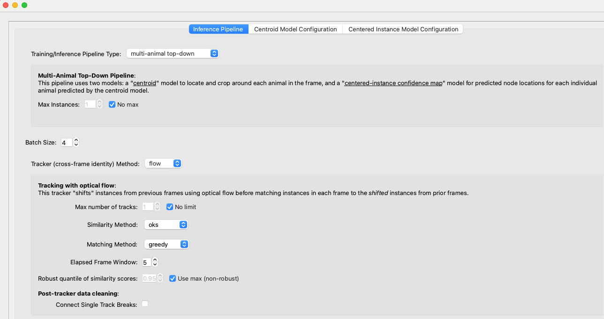
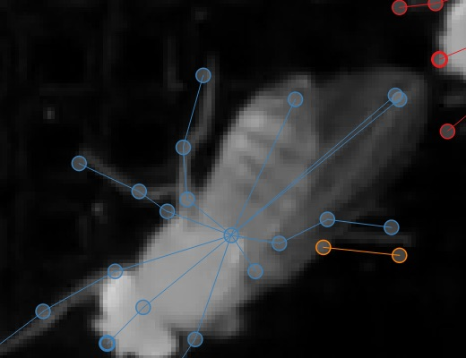
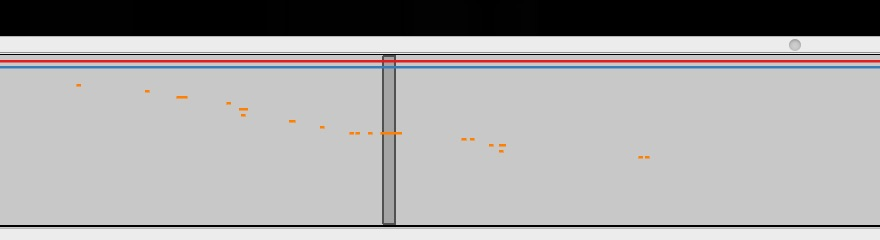
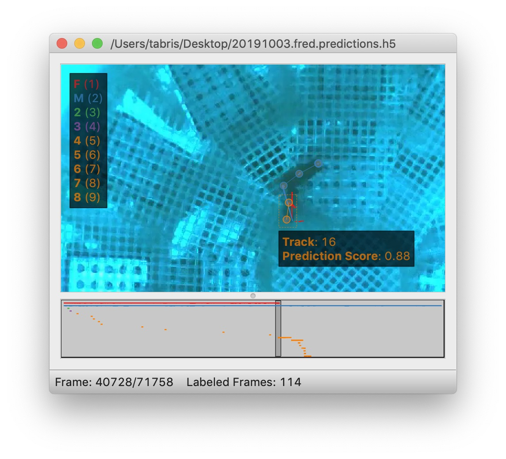
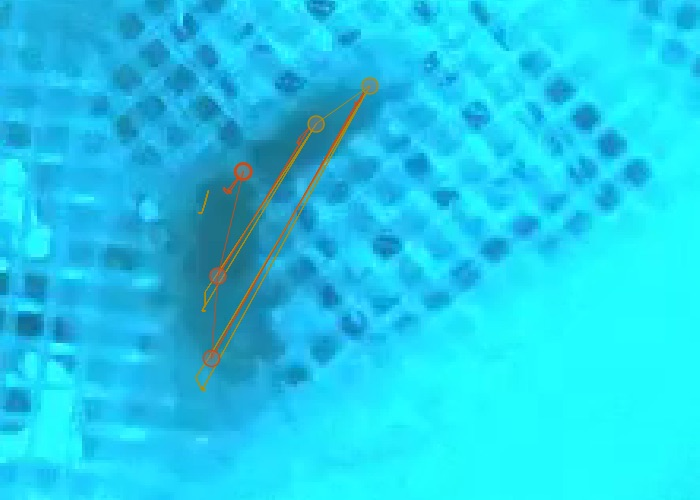
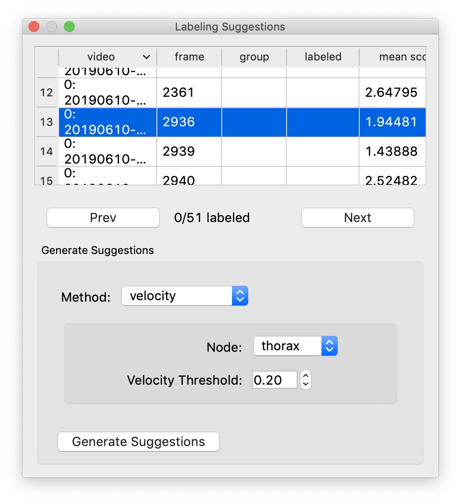

*Case: You're happy enough with the frame-by-frame predictions but you need to correct the identities tracked across frames.*

The basics of [tracking](../tutorial/tracking-new-data.md) and [proofreading](../tutorial/proofreading.md) are covered in the [Tutorial](../tutorial/overview.md). You should go read that if you haven't already. Here we'll go into more details.

## Tracking methods

The process of predicting instances frame-by-frame and the process of putting these together into **tracks** (i.e., identities across frames) are distinct, although it's common to run them together during the inference pipeline. Obviously you can only track identities after you've predicted instances, but once you have predictions, it's easy to then run tracking by itself to try out different methods and parameters.

If you're getting poor results, you may want to try out different methods and parameters. Changing the **track window** and the **similarity** method—both explained below—can make a big difference.

The tracker will go through the predictions frame by frame and try to match instances on frame N to candidates which already have track identities assigned. These candidates are generated from a certain number of frames immediately prior to frame N (what we refer to as the “tracking window”).

If you use the “**simple**” tracker then the frames chosen are the instances from prior frames. If you use “**flow**” as the tracking method then SLEAP takes instances from the prior frames and uses optical flow ([Xiao et al., 2018](https://arxiv.org/abs/1804.06208)) to shift the points in the instances, and then uses these shifted points as the candidate instances.

There are currently three methods for matching instances in frame N against these candidates, each encoded by a cost function:

- “**centroid**” measures similarity by the distance between the instance centroids
- “**iou**” measures similarity by the intersection/overlap of the instance bounding boxes
- “**instance**” measures similarity by looking at the distances between corresponding nodes in the instances, normalized by the number of valid nodes in the candidate instance.
- “**normalized_instance**” measures similarity by looking at the distances between corresponding nodes in the instances, normalized by the number of valid nodes in the candidate instance and the keypoints normalized by the image size.
- “**object_keypoint**” measures similarity by measuring the distance between each keypoints from a reference instance and a query instance, takes the exp(-d**2), sum for all the keypoints and divide by the number of visible keypoints in the reference instance.

Once SLEAP has measured the similarity between all the candidates and the instances in frame N, you need to choose a way to pair them up. You can do this either by picking the best match, and the picking the best remaining match for each remaining instance in turn—this is “**greedy**” matching—or you can find the way of matching identities which minimizes the total cost (or: maximizes the total similarity)—this is “**Hungarian**” matching.

Finally, you have an optional second-pass method which “cleans” the resulting identities with **"Cull to Target Instance Count"**. To use this method, you specify a target number of tracks by setting the **"Target Number of Instances Per Frame"** (i.e., how many animals there are in your video). SLEAP then goes frame by frame and removes (or culls) instances over this target number. To cull to a target number of instances per frame, navigate to the Inference Pipeline via Predict >> Inference, then:

1. Specify the **Tracker (cross-frame identity) Method**
2. Uncheck the **No target** 
3. Specify the **Target Number of Instances Per Frame**
4. Check the **Cull to Target Instance Count** 

Once you have the desired number of instances in every frame, SLEAP connects identities with a simple heuristic: if exactly one track identity was dropped from frame N and exactly one new track identity was added in frame N+1, it matches up the dropped and the new tracks.

## More training data?

Often your models will fail to predict *all* of the instances on *all* of the frames. Even if you're happy enough with the result since you can interpolate missing data, it's possible that the missing instances will cause problems when we try to determine track identities across frames, so if your tracking results are poor, you may wish to [Importing predictions for labeling](importing-predictions-for-labeling.md).

## Color palettes

When you're proofreading track identities, the first step should always be to enable "**Color Predicted Instances**" in the View menu. Choosing the right color palette can also make a difference. If there are a small number of instances you're tracking, the "five+" palette will make it easier to see instances which were assigned to later tracks, both in on the video frame:

and on the seekbar:

If there are a large number of instances you're tracking, then a palette with a large number of distinct colors can make it easier to see each distinct instance. The "alphabet" palette has 26 visually distinctive colors.

Sometimes the background in the video will make it hard to see certain colors in a palette. It's possible to edit palettes, as explained in the [`View`](../learnings/gui.md/#view) menu section of the [`GUI`](../learnings/gui.md).

## Proofreading

There are two main types of mistakes made by the tracking code: lost identities and mistaken identities.

**Lost Identities:** The code may fail to identity an instance in one frame with any instances from previous frames.

Here's a strategy that works well for fixing **lost** identities:

1. Turn on colors for predicted instances and use a good color palette (as explained above).
2. Change the "**Trail Length**" to a number greater than zero. These trails show where instances in each track were in prior frames.
3. Use the keyboard shortcut for the "**Next Track Spawn Frame**" command in the **"Go"** menu to jump to frames where a new track identity is spawned.
4. Select the instance with the new track identity—either use the mouse, type a number key to jump to that instance, or use the **Select Next** key to cycle through instances.
5. The color of the track trail may help you determine which track identity should have been used.
6. Hold down the **Show tracks legend** key ([`selection_keys`](../learnings/gui.md/#selection-keys)) with an instance already selected and you'll see a color-coded list of numbered tracks, like so:

You can then type the number key listed next to the track (while still holding down the **Show tracks legend** key) to assign the selected instance to the corresponding track. In the image above, you'd want to hit **Command + 1** to assign the orange instance to the red **"F"** track.

**Mistaken Identities:** The code may misidentify which instance goes in which track.

Mistaken identities are harder to correct since there's no certain way to find them—if we knew where they were, then we wouldn't have gotten them wrong in the first place. But there are some strategies to make it easier to locate them in your predictions.

One strategy is to set the trail length to a **number greater than 0** (e.g. 50) and jump through the predictions using the **frame next large step** hotkey. It's usually possible to see identity swaps by looking at the shape of the track trails, as here:

The downside of this method is that when you find the set of frames which contain a swap, you'll then have to go through the frames individually to find exactly where the swap occurs. (You may want to turn off trails while doing this, since they can make it harder to see where the instances are in the current frame, and they also make it slower to move between frames.)

Another strategy is to generate **velocity**-based frame suggestions:

In the "**Labeling Suggestions**" panel, choose the **"velocity"** method. You should select a node with a relatively stable position relative to the position of the body (i.e., not an appendage), and start with the default threshold.

If there are far too many frame suggestions, then make the threshold higher. If there aren't very many, you might try lowering the threshold (or this may indicate that this method won't work well for this file).

Once you're happy with the number of suggested frames, you can step between these (using the "**Next Suggestion**" hotkey in the "Go" menu) and quickly review whether this is in fact a swap by looking at the track trails or reviewing adjacent frames. If you've found a swap, either use the keyboard shortcut for the "**Transpose Instance Tracks**" hotkey in the "Labels" menu, or select one of the swapped instances and use **Show tracks legend** hotkey plus a number key, just like you do for fixing lost identities (as explained above).

You can optionally select "**Propagate Track Labels**". This means that switching the tracks in one frame will also be applied in all subsequent frames.

## Orientation

In some cases it may be difficult to see the orientation of the predicted instances. You can make it easier to see the orientation by changing the style of the edges drawn between nodes from thin lines (as shown above) to **wedges**, as shown here:

The wedges point from each **source** node to its **destination** node(s) in your skeleton. You can set the edge style using the "**Edge Style**" submenu in the "View" menu.