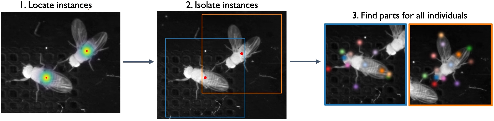
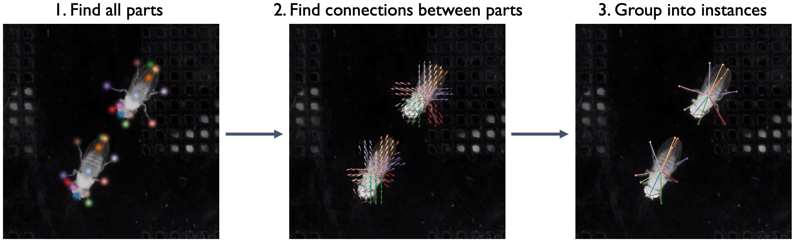

# Training Options

When you're ready to train you will have three choices for models: *single animal*, multi-animal **top-down**, or multi-animal **bottom-up**.

## Top-down
* In **top-down** mode for multiple animals, a network first finds each animal and then a separate network estimates the pose of each found animal
* This approach will train two models: one for locating each instance in the frame, and one for locating the parts for each of those instances. The models will be trained in that order.
* When using the topdown approach, it’s a good idea to choose an anchor part which has a relatively stable position near the center of your animal. You may also want to turn on the option to “Visualize Predictions During Training” (although this will make training run a bit more slowly).

## Bottom-up

In **bottom-up** mode, a network first finds all of the body parts in an image, and then another network groups them into animal instances using part affinity fields ([Cao et al., 2017](<https://arxiv.org/abs/1611.08050>)):

We find that top-down mode works better for some multi-animal datasets while bottom-up works better for others - to maximize the accuracy of predictions we recommend you to try both and see which one works best for your dataset.

In addition, SLEAP uses UNET as its default backbone, but you can choose other backbones (LEAP, resnet, etc.) from a drop down menu.

For more information on configuring types of models, see [Configuring models](configuring-models.md).

