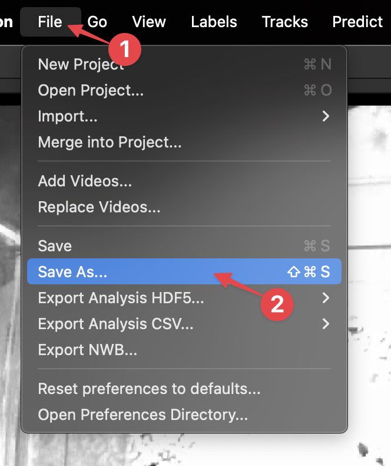
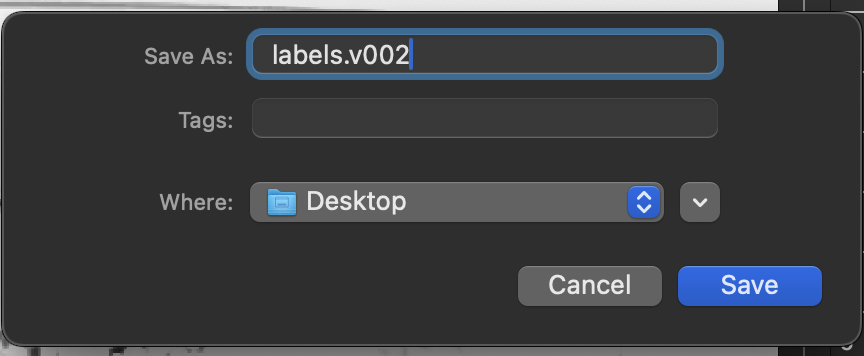
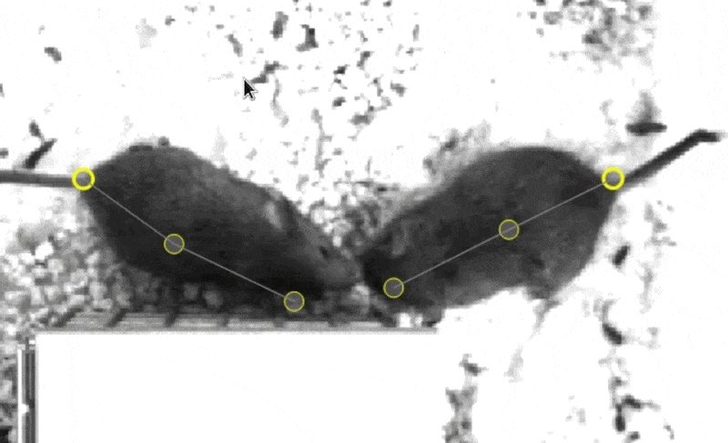
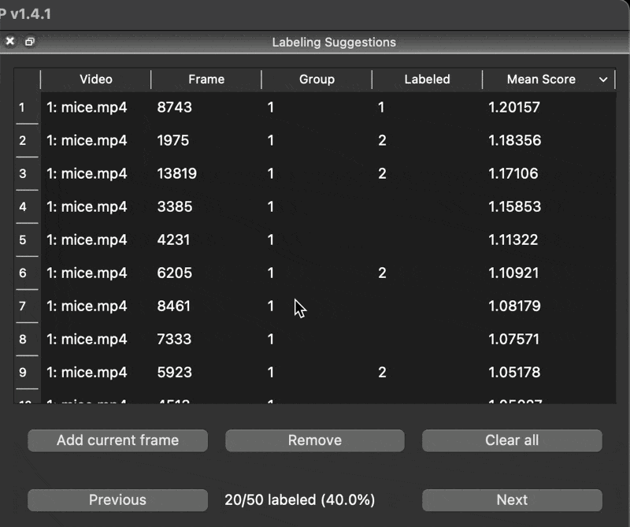
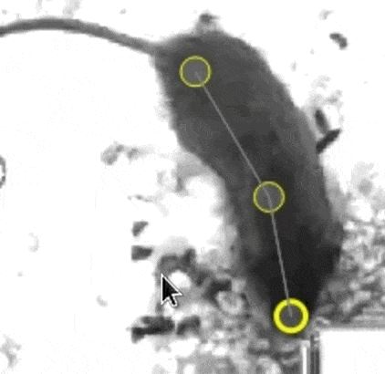
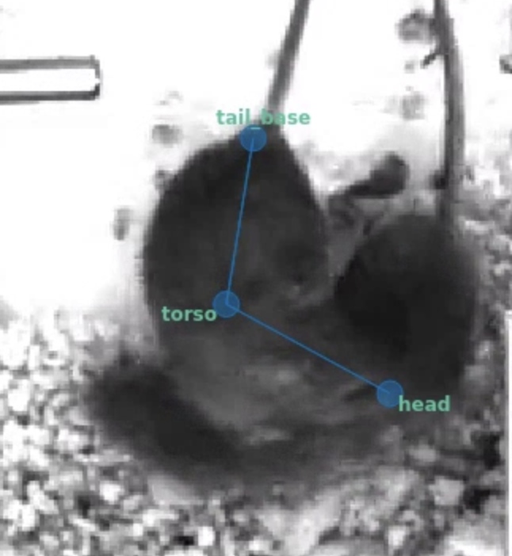
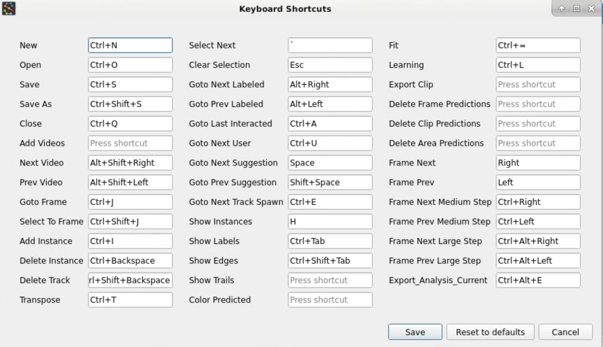
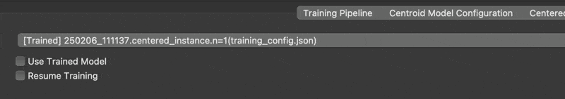
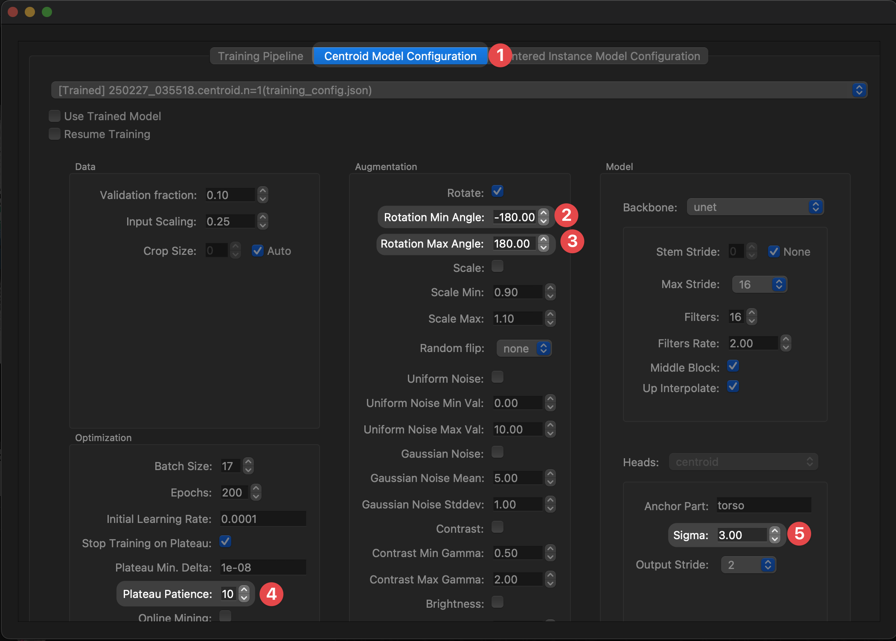
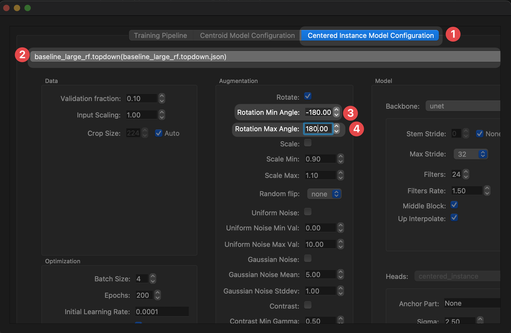

# 5. Correcting predictions

In [the previous step](training-a-model.md), we trained a model with a single labeled frame and used that model to generate predictions on the remaining unlabeled frames.

In this step, we will learn the [**human-in-the-loop**](../learnings/prediction-assisted-labeling.md) labeling workflow, in which we correct predictions rather than labeling from scratch. Once we've labeled enough frames, we'll train a new model which will produce more accurate predictions that require fewer corrections. Each time you repeat this process. 

## Save a new version

It's a good idea to save frequently so you don't lose your work, but sometimes we want to be able to go back to a specific version of the project.

This is particularly useful in case we want to go back to the state that the project was in when we trained a model so that we can reproduce the process.

To save a new version:

1. Click **File** → **Save as...**:

    

2. The version in the filename will be automatically incremented (`labels.v001.slp` → `labels.v002.slp`), so you can just click **Save** to create a new version:

    

!!! tip
    You can quickly create new versions using the keyboard by pressing <kbd>ctrl+shift+s</kbd> → <kbd>enter</kbd>

Nice! Now we can always go back to this version of the labeling project if we need to.

## Labeling from predictions

1. Go to an unlabeled frame in the **Labeling Suggestions** window by **double-clicking** any of the rows.

    !!! tip
        You can press <kbd>space</kbd> / <kbd>shift+space</kbd> to quickly navigate between frames in the **Labeling Suggestions** list.

2. If the frame you selected had predictions generated, you'll see **predicted instances** which are colored as yellow and whose nodes cannot be moved.

    To create an instance from the prediction, **double-click** the predicted instance:

    

    After the instance is created, just move the nodes to their correct locations.

    !!! warning
        Make sure that **all** animals visible in the frame are labeled! This is important to do even if there aren't predictions for all animals.

3. Use the initial predictions to quickly get to **15 to 20 labeled frames**.

    Do you notice any patterns in the kinds of mistakes the model makes? As you label, try to add frames that represent different kinds of failure modes to direct how the model performs in different situations.
    
    Try sorting by the prediction scores and focusing both on frames that the model is overconfident about (high scores) and ones in which it underperforms (low scores):

    

### Labeling tips and tricks

### Red / green nodes

When the models generate good predictions, it may not be necessary to correct the location of all of the nodes.

Nodes that haven't been moved from their predicted locations are colored in **red**, but turn **green** as soon as you click them. This helps to keep track of which nodes were corrected and which weren't.

If the initial predicted node locations are good, it's totally fine to leave them in their red state. These will still be considered as "ground truth" locations. If you like using the colors to keep track of your work, you can use the <kbd>shift+left-button</kbd> shortcut to quickly mark all nodes as green.

### Visibility and missing nodes

In some cases, there simply is not enough information to correctly position a node. What do we do in cases like this where there is total **occlusion** of a node?

We could take our best guess, but this will more often than not result in training the model to make overconfident predictions.

As an alternative, SLEAP allows you to **right-click** a node to mark it as **not visible** (the position doesn't matter):

Nodes marked as not visible (denoted by the gray and italicized font with a dark background) are interpreted as not present. Models will be trained to predict a low confidence score for that example, thus allowing them to be excluded (replaced with `NaN`) when we filter out low scoring predictions.

**Note:** The exact position of the node doesn't matter as it will be ignored at training time.

!!! warning
    Sometimes nodes will be incorrectly predicted as not visible. Don't forget to toggle them to be visible when correcting predictions!

!!! note
    For future reference, There’s no need to be consistent about which animal you label with which instance for the case of multiple animals. For instance, suppose you have a male and a female. It’s fine to label the male with the blue instance in some frames and the orange instance in others. Tracking (and track proofreading) is the final stage in the workflow and occurs after predicting body part locations.

### Keyboard shortcuts

SLEAP has lots of keyboard shortcuts to help speed up the labeling process.

Navigating the menus will help to find which features have a keyboard shortcut associated with them.

You can also go to the **Help** menu → **Keyboard Shortcuts** to see a list of shortcuts and configure them to your liking:

## Re-training

Once you've labeled enough frames (15 to 20 is good), it's time to train a new model.

Since last time was a special case where we were training with a single image, let's adjust our training settings to the more standard setup.

1. In the menu bar at the top, click **Predict** → **Run Training...** to open the training pipeline configuration window.

2. Go to the **Centroid Model Configuration** tab. You'll notice that the previous model configuration we trained with will be preloaded. This helps you as tune settings across iterations.

    Let's reset to one of the built-in baseline configurations (`baseline.centroid`) by selecting it from the dropdown:

    

3. Next, adjust a couple of the settings for the centroid model:

    **Plateau Patience** → **10** [^1]

    [^1]: SLEAP will stop training early when a plateau is detected in the validation loss to prevent overfitting. Setting the patience to 10 results in earlier stopping for faster training runs.

    **Rotation Min/Max Angle** → **-180/180** [^2]

    [^2]: During training, we apply augmentations to the raw images and corresponding poses to generate variants of the labeled data. Since we have an overhead perspective in this video, it is appropriate to apply rotations across the full range of angles and will help to promote generalization.

    **Sigma for Centroids** → **3** [^3]

    [^3]: Increasing sigma makes the centroid confidence maps coarser, making it easier to detect the animals but less precise.

    

4. Head over to the **Centered Instance Model Configuration** tab.

    We'll again reset the configuration by selecting the `baseline_large_rf.topdown` [^4] profile.

    [^4]: This profile configures a model architecture that has a larger **receptive field size**. This is a property of the architecture that dictates how large of an area that the model can reason over. Larger receptive field sizes improve performance when there are larger features on the animal and may be necessary to prevent errors such as head/tail ambiguities that can only be resolved from wider context.

    Then, tweak the following settings:

    **Rotation Min/Max Angle** → **-180/180** [^5]

    [^5]: During training, we apply augmentations to the raw images and corresponding poses to generate variants of the labeled data. Since we have an overhead perspective in this video, it is appropriate to apply rotations across the full range of angles and will help to promote generalization.

    

5. Hit the **Run** button at the bottom of the window to start training!

    This training run will take a bit longer than last time (**~15-20 mins**).
    
    **Note:** You can always hit the **Stop Early** button to cut a training run short if you're happy with the results and don't want to wait for automatic early stopping.

    !!! tip
        Curious about how we chose these model settings? Here are some resources to learn more while you wait for your model to train:

        - <a href="../../learnings/configuring-models/#configuring-models" target="_blank">SLEAP: Configuring models</a>
        - <a href="../../learnings/troubleshoot-workflows" target="_blank">SLEAP: Troubleshooting workflows</a>
        - <a href="https://www.nature.com/articles/s41592-022-01426-1" target="_blank"> Pereira et al., *Nature Methods* (2022)</a> (**Fig. 4**)

What kinds of improvements do you observe after this training round?

You did it!

[*Next up:* Tracking new data](tracking-new-data.md)