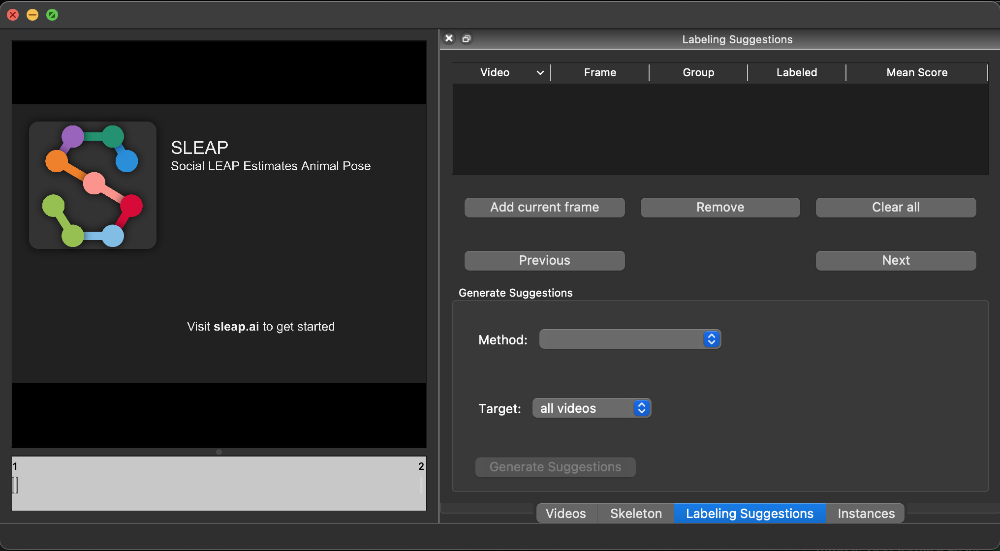
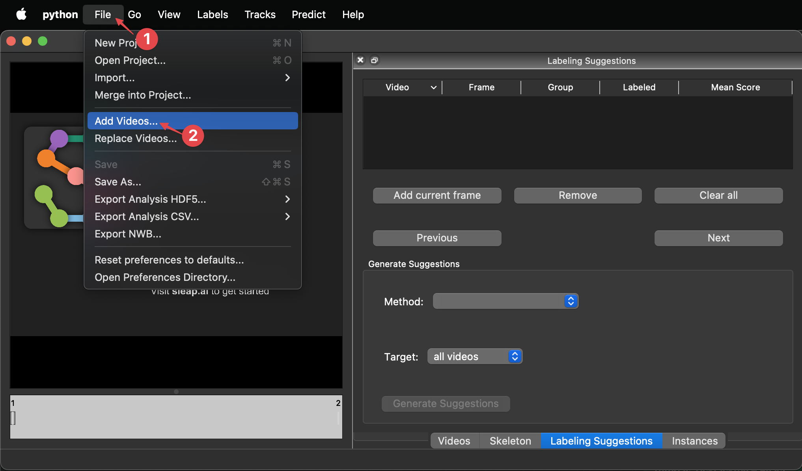
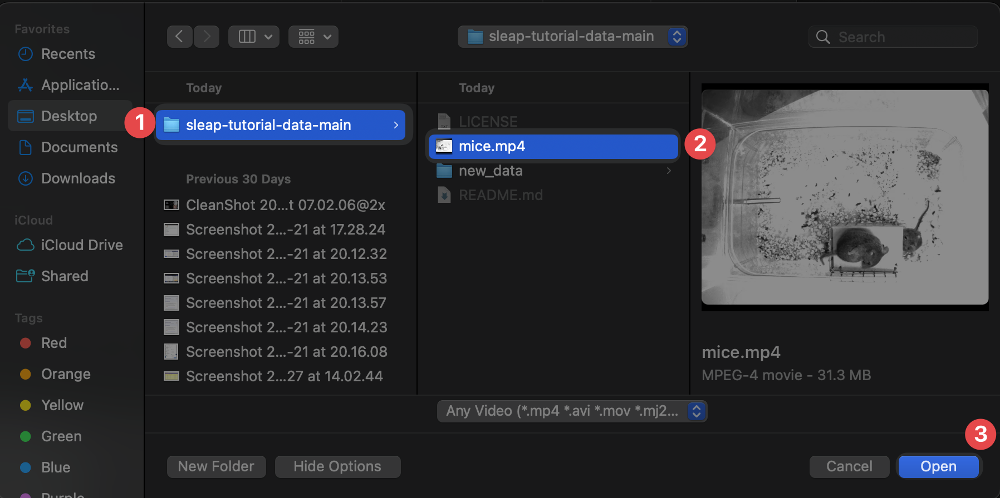
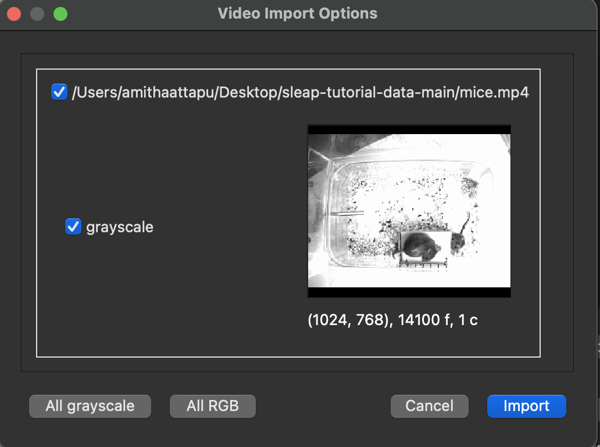
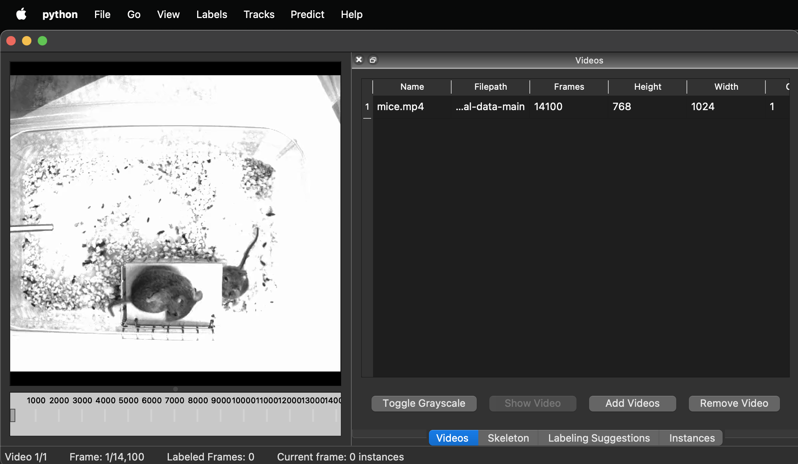
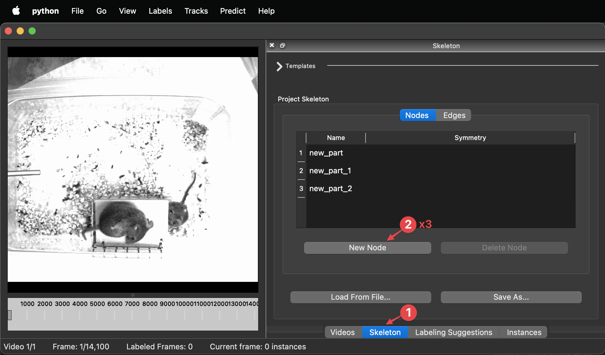
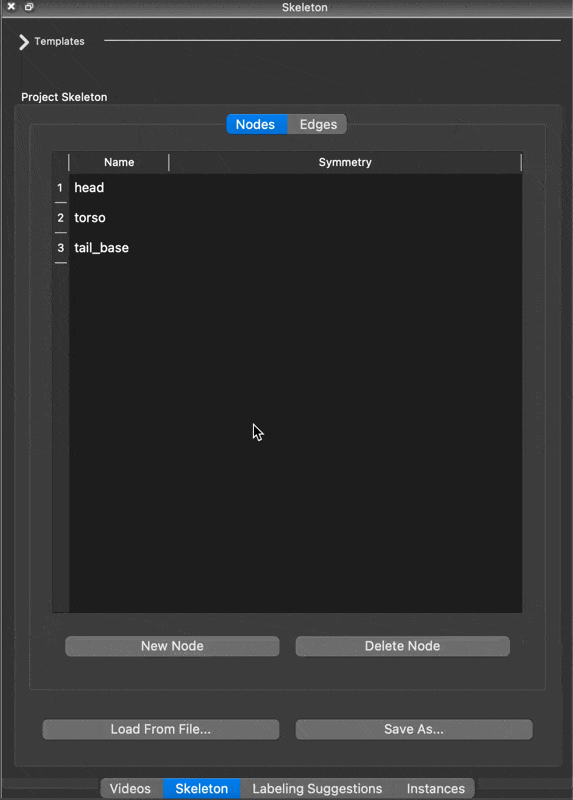
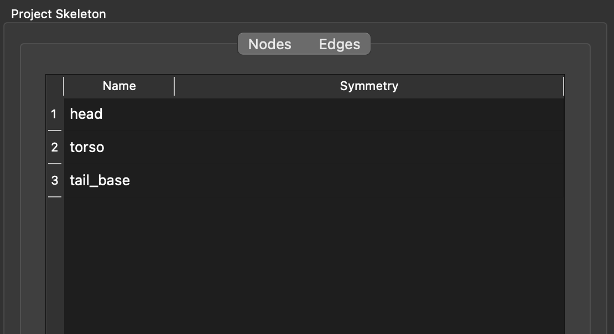
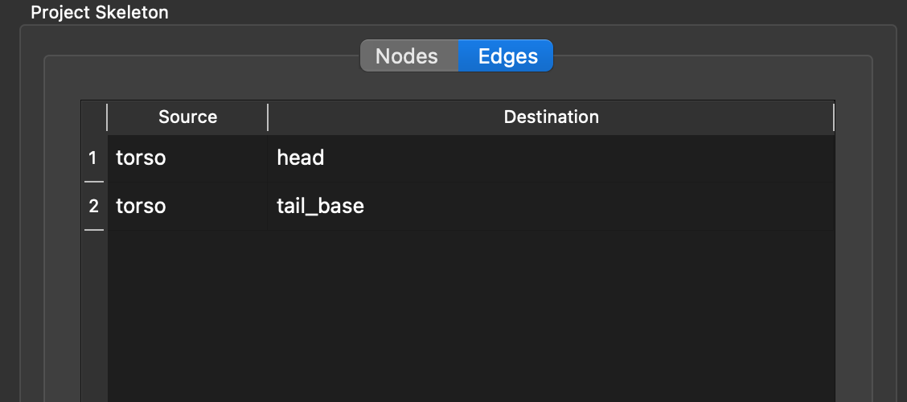

---
hide:
  - toc
---

The input to SLEAP are video files, so we'll first need to load some data to work with. For this tutorial, we've prepared a couple of videos that represent a typical behavioral setup in the lab.

## Download the Data 

To follow this tutorial, you need to download the required data by **cloning a Git repository**. Don’t worry if you’ve never used Git or a terminal before—just follow the steps below carefully.  

### 1. Open a Terminal  

You will need to enter commands in a **terminal**. If you're unsure how to open one, follow these instructions:  

#### How to open a terminal:  
!!! hint ""
    === "Windows"  
        Open the *Start menu* and search for  **Command Prompt**.

    === "Linux"  
        Press <kbd>Ctrl</kbd> + <kbd>Alt</kbd> + <kbd>T</kbd> to open a new terminal.  

    === "MacOS"  
        Press <kbd>Cmd</kbd> + <kbd>Space</kbd>, then type **Terminal** and open it.  

### 2. Check If Git Is Installed  

Once your terminal is open, check if Git is already installed by typing:  

```sh
git --version
```
If you see a version number (e.g., git version 2.39.1), Git is installed, and you can skip this step. If you get an error, follow the steps below to install Git.

**How to Install Git:**
!!! hint ""

    === "Windows"
        1. Download the Git for Windows installer from [git-scm.com](https://git-scm.com/downloads/win).
        2. Run the installer and follow the default settings.
        3. Once installed, restart your terminal and run 'git --version' in terminal to confirm the installation.

    === "MacOS"  
        1. Open a terminal and type:  
            ```sh  
            brew install git  
            ```  
        If you don’t have Homebrew installed, first install it by running:  
            ```sh  
            /bin/bash -c "$(curl -fsSL https://raw.githubusercontent.com/Homebrew/install/HEAD/install.sh)"  
            ```  

    === "Linux (Debian/Ubuntu)"  
        Open a terminal and type:  
        ```sh  
        sudo apt update && sudo apt install git  
        ```  

    === "Linux (Fedora)"  
        Open a terminal and type:  
        ```sh  
        sudo dnf install git  
        ```
Once Git is installed, you're ready to proceed!

### 3. Navigate to the Desired Location  

Navigate to **Desktop** folder, to clone the git repository. This step ensures tutorial data is saved in **Desktop**:  

=== "Windows"  
    ```sh  
    cd C:\Users\YourUsername\Desktop  
    ```  
    Replace `YourUsername` with your actual Windows username.  

=== "MacOS & Linux"  
    ```sh  
    cd ~/Desktop  
    ```  

### 4. Clone the Repository  

Now, type the following command and press <kbd>Enter</kbd>:  

```sh  
git clone https://github.com/talmolab/sleap-tutorial-data.git
```


The cloned folder/tutorial data will be located on the Desktop under the name **sleap-tutorial-data-main**. The folder will contain the following:

 - **mice.mp4**: The main video file for training the model.
 - **new_data**: This folder will be used later in [Step 6](tracking-new-data.md).

## Import videos into SLEAP

1. Open a terminal and activate the SLEAP environment by running the following command:

    ```bash
    conda activate sleap
    ```

2. Open a terminal. Then launch the SLEAP GUI by typing this command followed by <kbd>Enter</kbd> or <kbd>Return</kbd>:

    ```bash
    sleap-label
    ```

    

3. Go to **File** → **Add Videos...** to open the file browser.

    


4. **Open** the mice.mp4 from the git cloned folder **sleap-tutorial-data-main**. For future reference, SLEAP currently supports mp4, avi, and h5 files[^1].
[^1]: SLEAP currently supports mp4, avi, and h5 files. For mp4 and avi files, you’ll be asked whether to import the video as grayscale. For h5 files, you’ll be asked the dataset and whether the video is stored with channels first or last.


    

5. The video import interface will appear. Click **Import** to finish adding the videos.

    

    You'll now see the first video in the GUI:

    

## Configure skeleton

1. Click on the **Skeleton** tab on the right, then click on **New Node** three times to create three entries in the table.

    

2. For each node, double-click on the name to edit it, then <kbd>Enter</kbd> to save.
   
    Name them **head**, **torso**, and **tail_base**.

    

3. Switch to the **Edges** tab and add connections: **torso** → **head**, and **torso** → **tail_base**.

    

The final skeleton setup should look like this:






You did it! 

[*Next up:* Initial labeling](initial-labeling.md)


