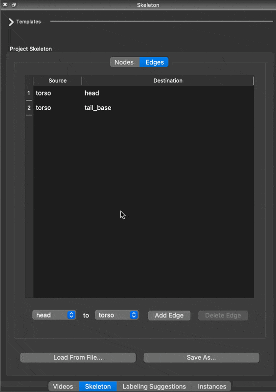
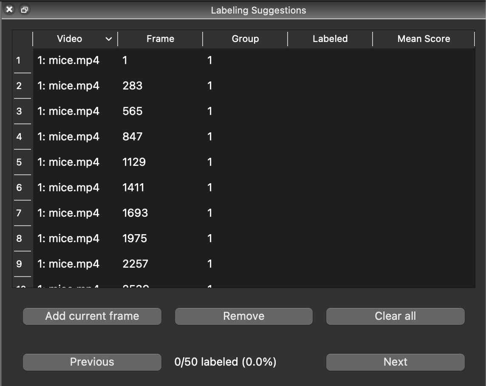
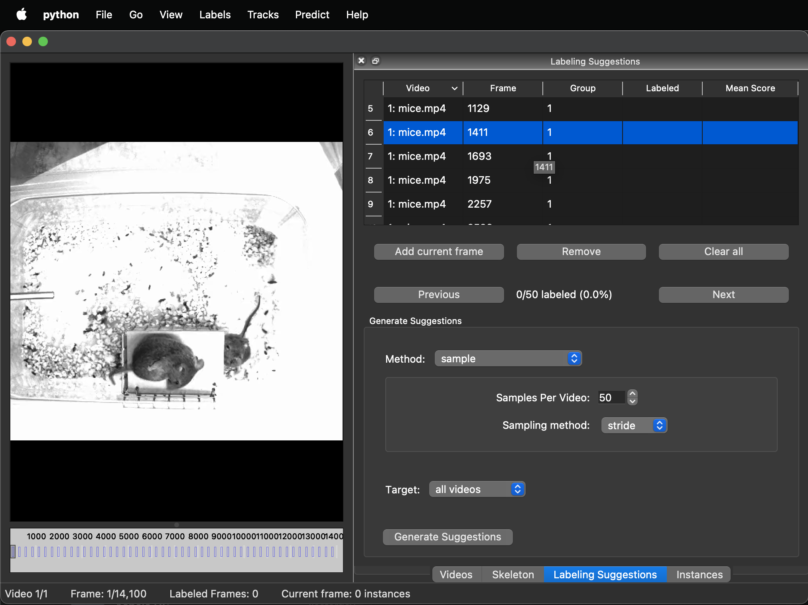
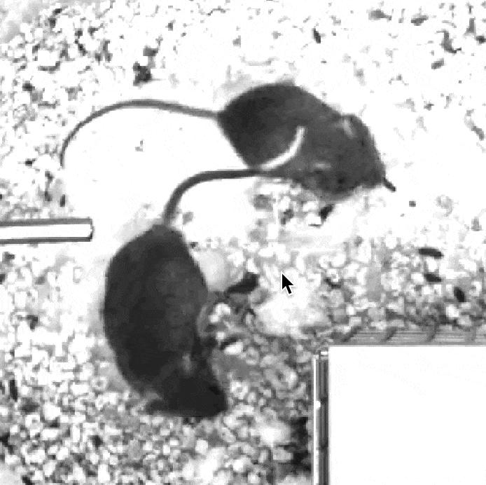
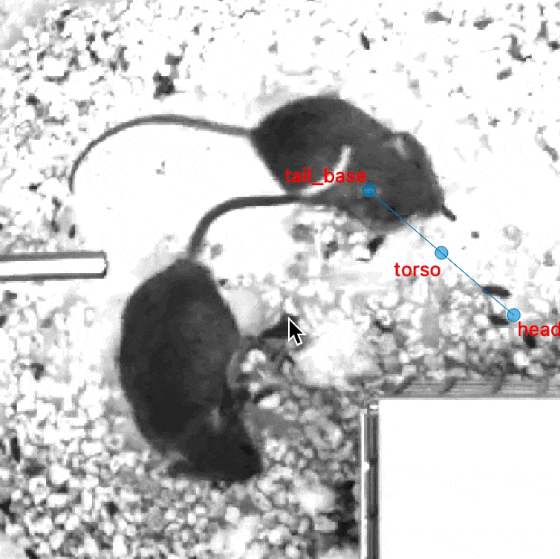
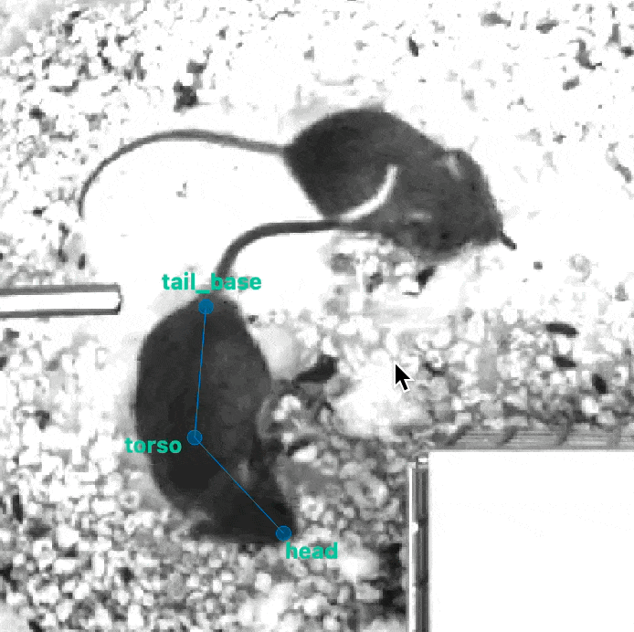
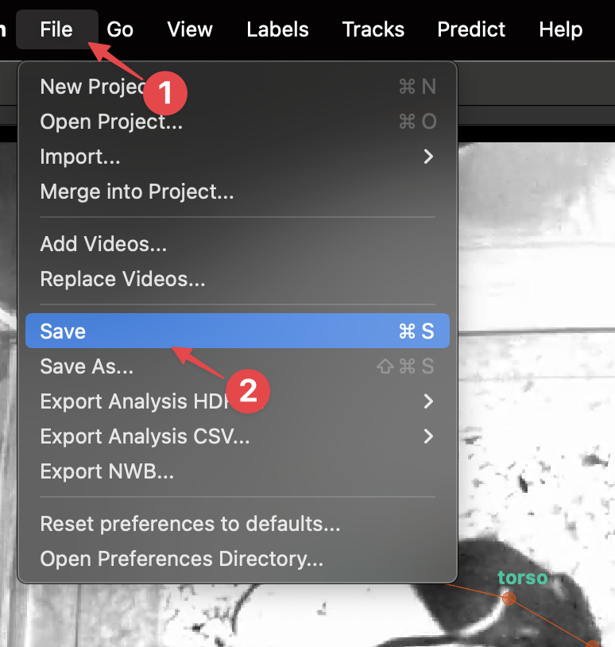

# 3. Initial labeling

## Generate suggestions

We start by assembling a candidate group of images to label. You can either pick your own frames or let the system suggest a set of frames using the “Labeling Suggestions” panel. SLEAP can give you random or evenly-spaced samples, or it can try to give you distinctive groups of frames by taking the image features into account.

For this tutotial, let’s just get 50 random frames. 

1. Switch to the **Labeling Suggestions** tab.
2. Set **Method** to **sample** and **Samples Per Video** to **50**.

    

3. Click **Generate Suggestions**.

You will now see the list of suggested frames populated with the 50 sampled frames:

## Labeling the first frame

In SLEAP, **instances** are a copy of the skeleton set to a specific pose on an animal.

We **label a frame** by creating an instance for each visible animal.

1. Let's start with an easy frame. In the **Labeling Suggestions**, **double-click** on suggestion 6 (frame 1411):

    

2. To create an instance, **right-click** anywhere on the video → **Default**:

    

    !!! tip
        Want to make the nodes a bit easier to see? Try these settings:

        - **View** → **Edge Style** → **Wedge**
        - **View** → **Node Marker Size** → **12**
        - **View** → **Node Label Size** → **18**

3. Drag the nodes to their correct locations on the animal:

    

    !!! tip
        To zoom in and out, use the **scroll wheel** on your mouse, or the **pinch scroll** gesture on your touch pad.

4. For the next animal, **right-click** anywhere on the video → **Default**. This will make a copy of the first instance:

    

    Then, adjust the nodes to their correct locations on the second animal.

    !!! tip
        * To quickly move the entire instance, hold <kbd>alt</kbd> (PC) or <kbd>option</kbd> (Mac) while dragging any node of the instance.
        * You can rotate the instance by holding down the <kbd>alt</kbd> (PC) or <kbd>option</kbd> (Mac) while you then click on a node and use the scroll-wheel.

## Save the project

SLEAP projects contain everything including videos, skeleton, labeling suggestions, and the actual labeled frames and instances.

The project is saved in a single file with the `.slp` extension and can be easily moved across computers or shared with others. Videos and labeled images are not contained in this file, only their file paths.

If you move the video files or open the project on a different computer, SLEAP will just ask you to locate the videos if it can't find it automatically, so don't be afraid to move those `.slp` files around!

Let's save the project with what we've done so far:

1. Click **File** → **Save**:

    

2. In the dialog that appears, click **Save**.

!!! tip
    Don't forget to save often (<kbd>Ctrl+S</kbd> or **File** → **Save**) so you don't lose your progress!

You did it!

[*Next up:* Training a model](training-a-model.md)