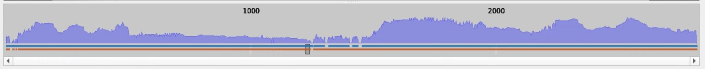
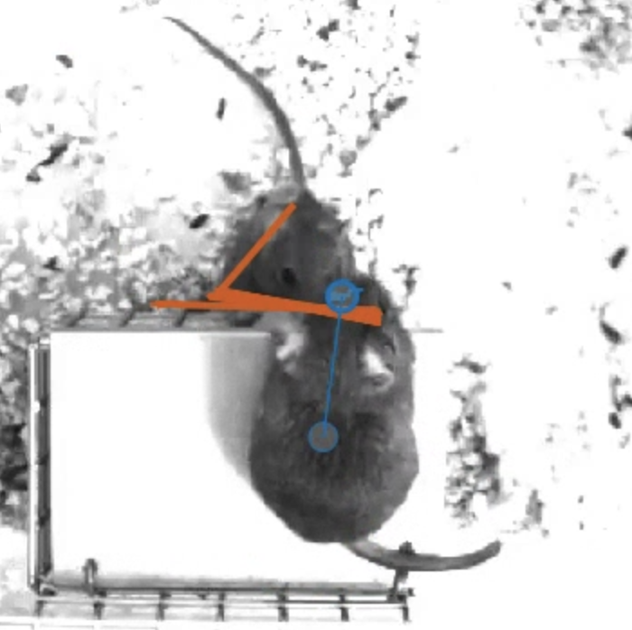
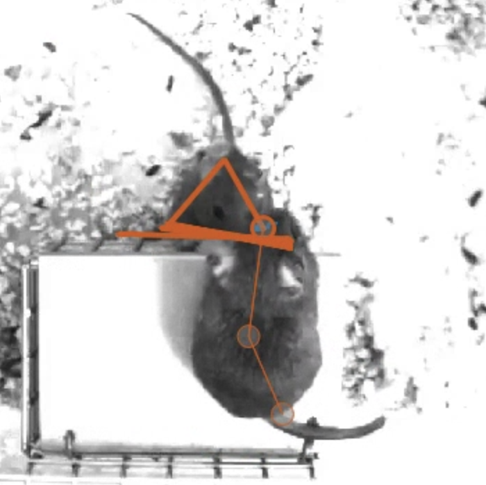
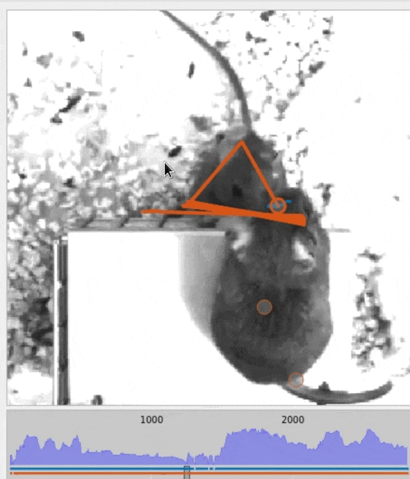

# 7. Proofreading

Automated algorithms are never perfect. Using these tools in your research workflow should always be followed by a quality control step.

This is especially important for tracking where making even one mistake results in catastrophic errors since an identity switch can propagate to the rest of the video.

You can read more about the most common mistakes made by the tracking algorithm [here](../learnings/main-mistakes-by-tracking.md). But for this tutorial, we will see how to handle switches.

1. To make it easier to spot switches, you can configure how SLEAP displays the predictions.

    Adjust the following settings:

    **View** menu → **Color Predicted Instances**

    **View** menu → **Trail Length** → **50**

    **Tracks** menu → **Seekbar Header** → **Min Centroid Proximity**

    This last option will compute and display the minimum inter-animal centroid-centroid distance:

    

    This is a heuristic for when animals are close together which reflects a common situation where tracking errors occur.

2. If you used the pretrained model and the tracking settings in the previous step, there will be a switch in this video at **frame 1,960**. Navigate over to that frame to see what's going on.

    !!! tip
        You can skip to a specific frame by going to **Go** → **Go to Frame...** or by pressing <kbd>Ctrl+J</kbd>.

    We see here that there were issues with the predicted poses since this is a difficult case where animals are in unusual and partially occluding positions:

    

       - **Frame 1,960**

         ---
       
         

      - **Frame 1,961** (ID switch)

         ---
       
         

    

    While the pose in 1,961 for one animal is correct, the other animal was not detected in either frame and a tracking error occurred.

3. To correct this switch in SLEAP, you can simply re-assign the track for the detected animal on frame 1,961.

    To do this, first **click on the instance** (any node) to select it.

    Then, assign it to `track_0` (blue) by either:

    - Pressing <kbd>Ctrl+1</kbd>, or
    - **Tracks** menu → **Set Instance Track** → **track_0**

    

    Note that the correction propagates to all future frames automatically, i.e., the track switch is applied to all predicted instances of the same track on subsequent frames.

4. Following best practice, it's a good idea to save a new version of the labels in case you need to go back to the original predictions prior to manual proofreading.

    To do this, go to **File** menu → **Save as...** → **Save** or just press <kbd>Ctrl+Shift+S</kbd> → <kbd>enter</kbd>.

You did it! 

[*Next up:* Exporting the results](exporting-the-results.md)