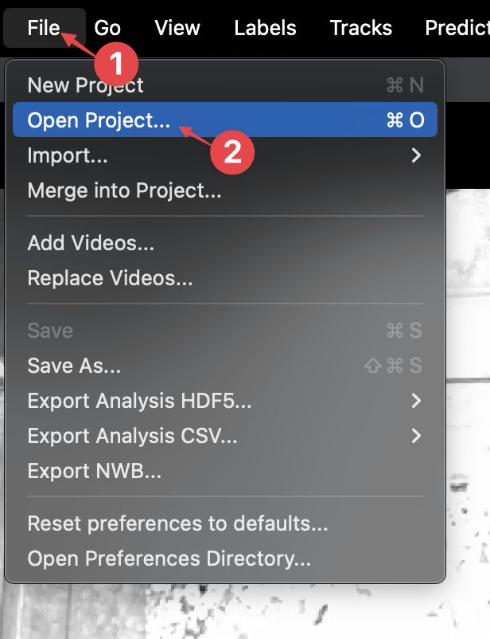
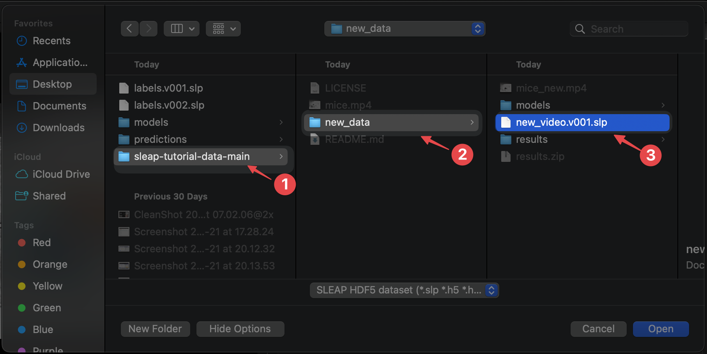
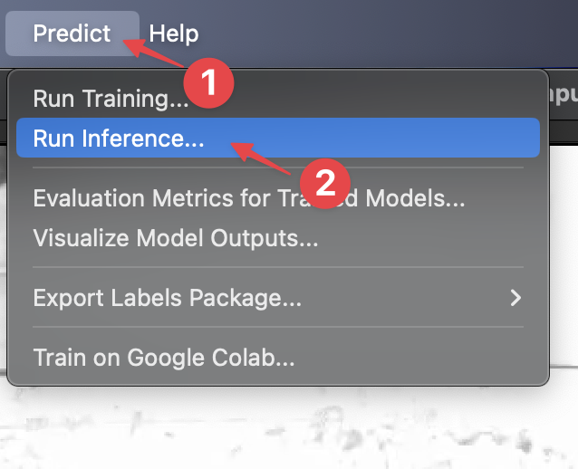
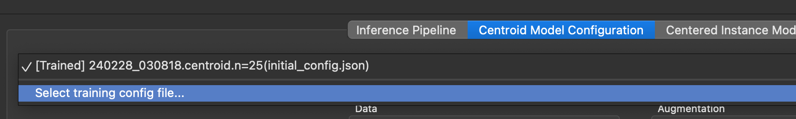
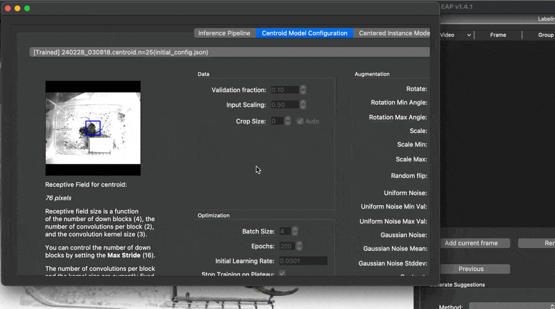
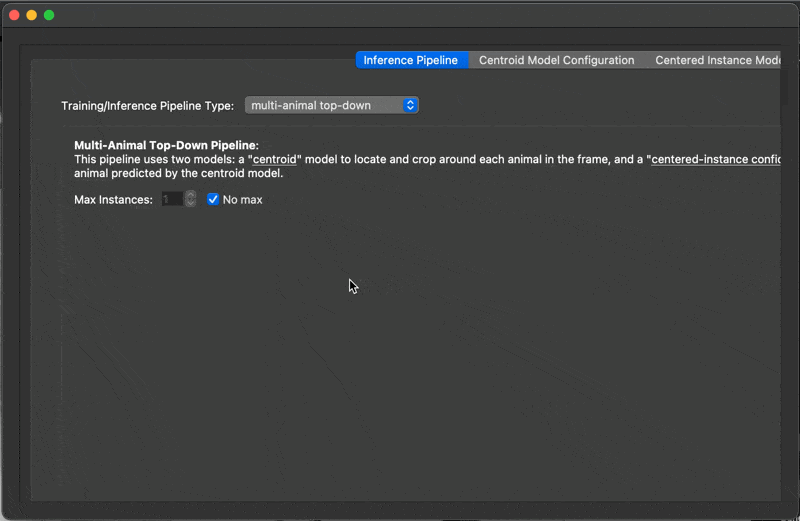
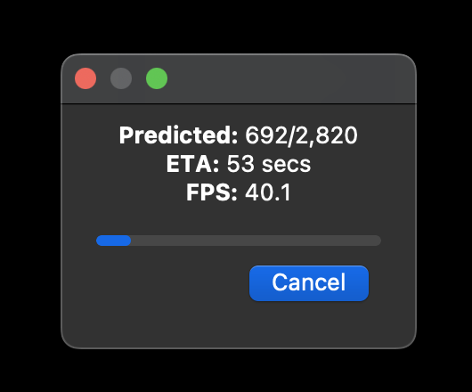
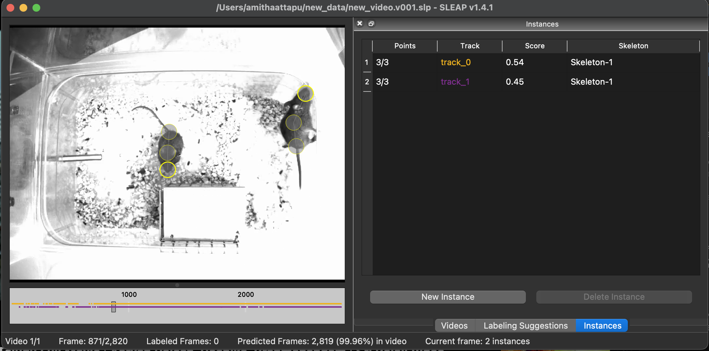

# 6. Tracking new data

Once you have a trained model, the next step is to apply it to track new data automatically.

We have included a testing video in the tutorial data which we will be tracking using our models.

1. First, go to the **File** menu → **Open Project**.

    

2. In the file browser, open the `new_data` folder downloaded in [step 2](importing-data.md) and select `new_video.v001.slp`:

    

    A new SLEAP window will appear with a blank project that contains the new video and nothing else.

    !!! tip
        In the typical workflow, you'll do this step programmatically such as through the [command line interface](../../reference/command-line-interfaces/#sleap-track).

3. Go to the **Predict** menu → **Run Inference** to open the inference configuration window.

    

    !!! warning
        Did you close the inference window and now cannot open it again? This is a known bug. Closing and re-opening SLEAP should allow you to run inference again.

4. *Optional:* For this tutorial, we include a pretrained model that you can use for inference, but if you were happy with the model you just trained in the previous step, you can manually select it in this step.
    
    !!! note

        If you are using the pretrained model, it will be pre-selected. Feel free to skip to step 5.

    By default, SLEAP uses the newest model in the `models` subfolder of the project folder. To change it, click over to the **Centroid Model Configuration** tab, then click **Select training config file...** from the dropdown menu at the top:

    

    Navigate up one directory and select any JSON file for the model that you just trained:

    

    Click over to the **Centered Instance Model Configuration** tab and repeat the same steps to select the other model.

    

5. Now we just need to set up the tracking configuration. During tracking, SLEAP connects predicted instances across frames that correspond to the same animal.

    Click on the **Inference Pipeline** tab, then adjust the following settings:

    **Tracker (cross-frame identity) Method** → **simple**

    **Max number of tracks** → uncheck **No limit** then set the value to **2**

    **Predict On** → **entire current video (2820 frames)**

    

6. Click **Run** and watch it go!

    

    This should take ~1 minute.

When tracking finishes you'll see predicted instances overlaid on the animals across the entire video:

Also note that the seekbar at the bottom is updated with raster plots indicating the presence of each track.

You did it!

[*Next up:* Proofreading](proofreading.md)