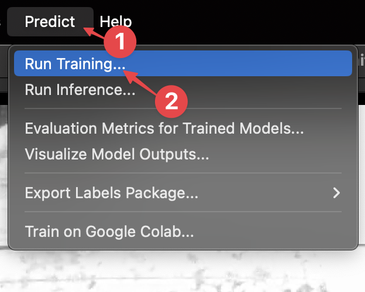
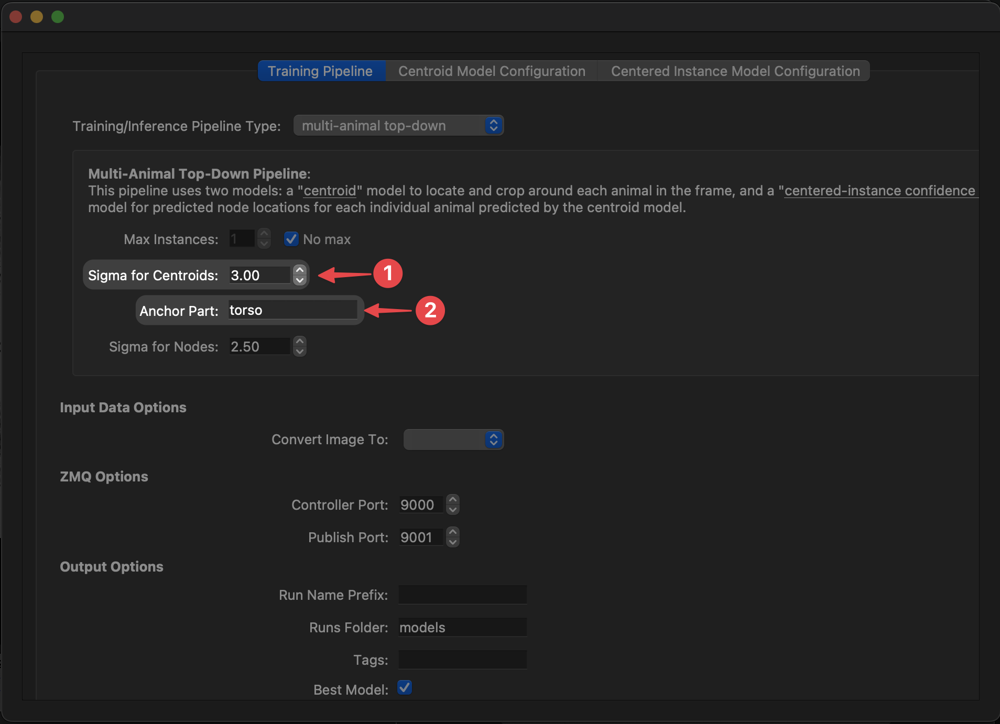
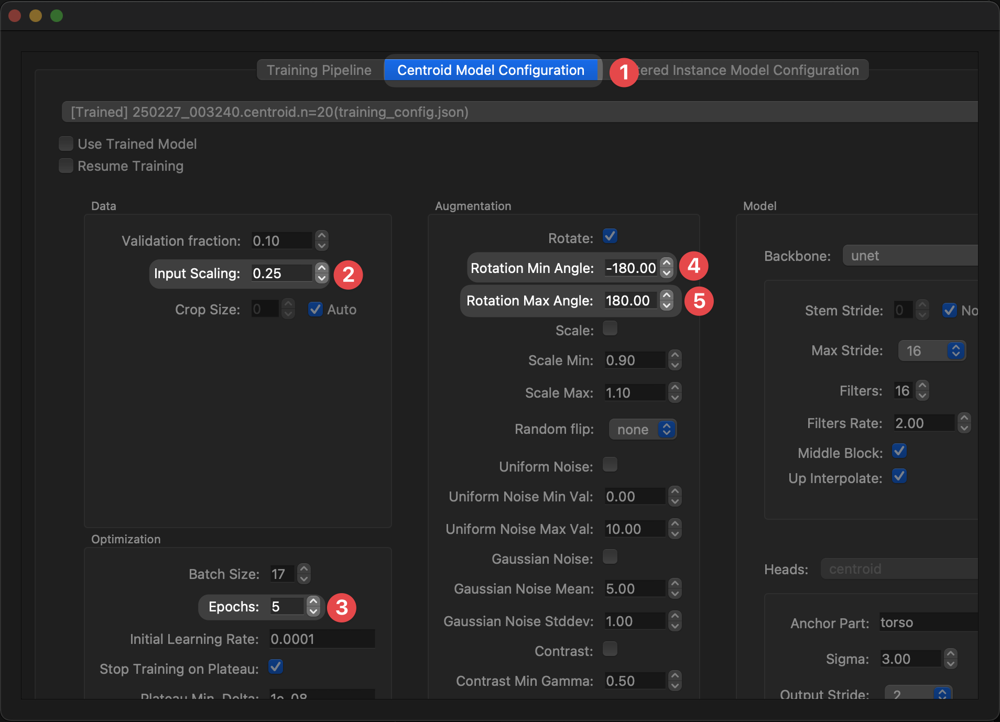
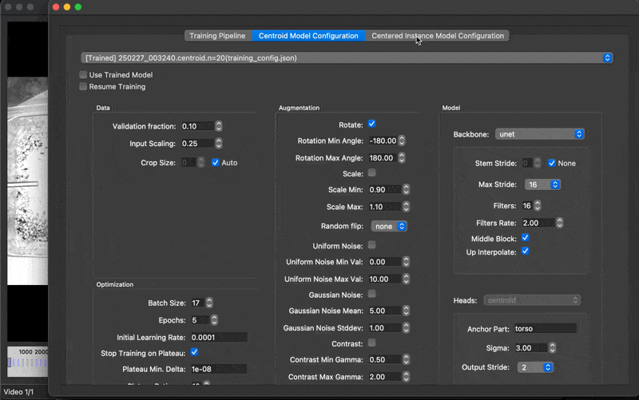
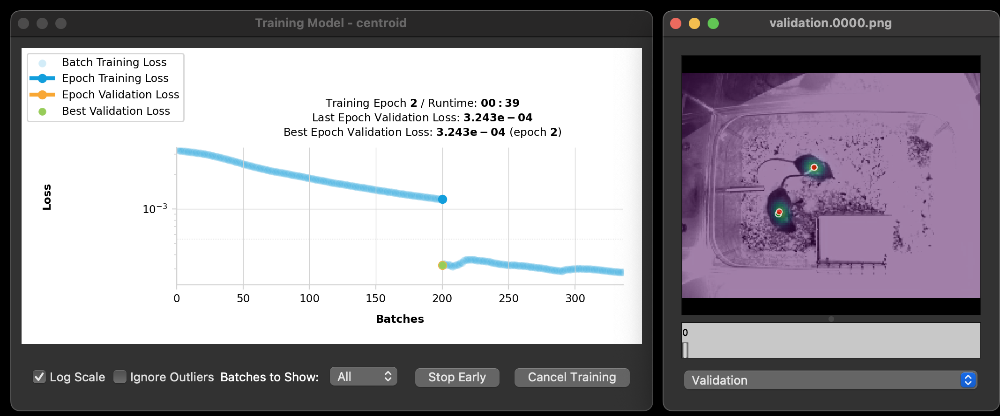
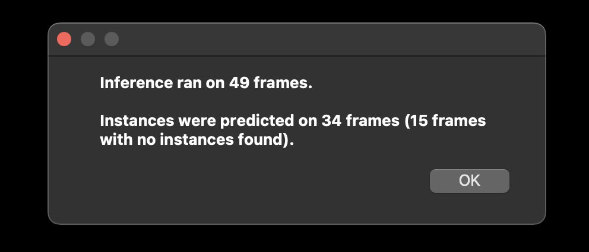

---
hide:
  - toc
---

# 4. Training a model

## Configuring an initial model

SLEAP allows you to customize the approach and architecture to fit your needs. Generally speaking, the bigger the model, the more accurate it will be, but also slower to train.

In the beginning stages of a project, we care more about **speed than accuracy**; our goal is to train a model that can generate predictions that are *just accurate enough* that it takes less time to correct its predictions than to label from scratch.

As we add more labeled frames, the accuracy will very quickly improve, so there's no point in training a big and slow model.

Even though we've only labeled a single frame so far, let's see what happens when we train a super lightweight model.

[Training options](../learnings/training-options.md) has more information about different training options, but for this tutorial let’s use the default settings for training with the “top-down” pipeline.

1. In the menu bar at the top, click **Predict** → **Run Training...** to open the training pipeline configuration window.

    

2. In the **Training Pipeline** tab, adjust these settings:

    **Sigma for Centroids** → **3** [^1]

    [^1]: Increasing sigma makes the centroid confidence maps coarser, making it easier to detect the animals but less precise.

    **Anchor Part** → **torso** [^2]

    [^2]: Choosing a specific node to use as the centroid leads to more consistent results than using the "center of mass" which often falls on different parts of the animal. This matters as the second stage of top-down models depend on the relative positioning of the animal within the centroid-anchored crop.

    

3. Go to the **Centroid Model Configuration** tab and change these settings:

    **Input Scaling** → **0.25** [^3]
    

    [^3]: Since the centroid of the animal can be detected coarsely, we can reduce the input image resolution to save on a lot of computation, at the expense of localization accuracy. This is a good trade-off in the early stages of labeling when little training data is available anyway.

    **Epochs** → **5** [^4]

    [^4]: SLEAP training occurs in epochs, where one epoch consists of the larger of `(number of training images) / (batch size)` or `200` batches. With larger dataset sizes, one epoch is one pass over the training data. Normally, SLEAP will stop training early when a plateau is detected in the validation loss to prevent overfitting, but since we're training with a single image, we'll set this manually to enable a quick and dirty training run.

    **Rotation Min/Max Angle** → **-180/180** [^5]

    [^5]: During training, we apply augmentations to the raw images and corresponding poses to generate variants of the labeled data. Since we have an overhead perspective in this video, it is appropriate to apply rotations across the full range of angles and will help to promote generalization.

    

4. Go to the **Centered Instance Model Configuration** tab and change these settings:

    **Epochs** → **5** [^6]

    [^6]: SLEAP training occurs in epochs, where one epoch consists of the larger of `(number of training images) / (batch size)` or `200` batches. With larger dataset sizes, one epoch is one pass over the training data. Normally, SLEAP will stop training early when a plateau is detected in the validation loss to prevent overfitting, but since we're training with a single image, we'll set this manually to enable a quick and dirty training run.

    **Rotation Min/Max Angle** → **-180/180** [^7]

    [^7]: During training, we apply augmentations to the raw images and corresponding poses to generate variants of the labeled data. Since we have an overhead perspective in this video, it is appropriate to apply rotations across the full range of angles and will help to promote generalization.

    

5. Hit the **Run** button at the bottom of the window to start training!

    Training will start after a few seconds. You will see a window showing the loss and a preview of the predictions:

    

    Training for top-down models occurs in two stages (centroid → centered instance). SLEAP will automatically start the second stage once the first one finishes.

    This whole process should take **less than 5 minutes**.

6. Once training finishes, SLEAP will automatically use the model to predict instances in the remaining unlabeled frames in the **Labeling Suggestions**:

    

You did it!

[*Next up:* Correcting predictions ](correcting-predictions.md)